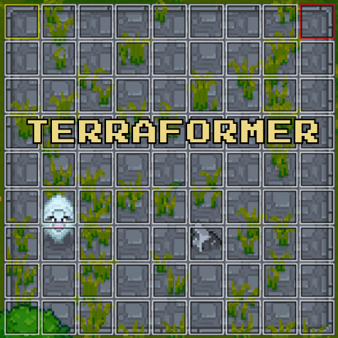

# Terraformer

  

## Overview  
Terraformer is a landscaping tool that allows the bulk placement and removal of tiles. Find it for purchase at your nearest elder. Get it while it's hot cause I'm definitely increasing the price.

## Features

### Adjustable shapes and sizes

Choose from square shape, line shape, circle shape or ring shape. Adjust the sizes of your shape through the item's interface or by using in-game hotkeys.

  

  

  

### Scoop and place liquids.

  

## Information

* This item can be purchased at the Elder for 5,000 coins. This may change in future updates.
* There is a range limit that will be upgradeable in the future. Red squares are out-of range. You can still place tiles, but it will only fill green tiles.
* There is a size limit that will be upgradeable in the future. The maximum width of any shape is currently 10 tiles.
* When scooping tiles, only the tile type that is in your bucket currently will be scooped. If there are no tiles in your bucket, the top left tile (yellow highlight) will be selected as the type of tile to scoop.
* When placing tiles, the placed tiles will be added to the inventory.
* When scooping tiles, overflow will be placed into the player's inventory.
* The direction of the line is based on the character's facing in-game.
* **Upgradeable** You can upgrade this item at the `Upgrade Station` for greater range and size.

## Known 'Bugs'
* When you place objects on water, breaking one of the objects will break all neighboring objects. This is by design in the base game, and I do not plan to modify this for now. Really, you shouldn't be able to place objects on water at all, but it looks cool so I'll secretly keep it.

## Feedback & Support  
If you encounter any issues or have feature suggestions, feel free to reach out! @ferrenfx on Necesse's discord's #modding channel.

## Update History

1.1.6 - Hotfix for item not showing up in elder shop.

1.1.5 - Hotfix for builder upgrade items.

1.1.4 - Updated to Necesse patch 0.32.0. Moved the `Upgrade Station` recipe to the `Tungsten Workstation` and changed the ingredients for it.